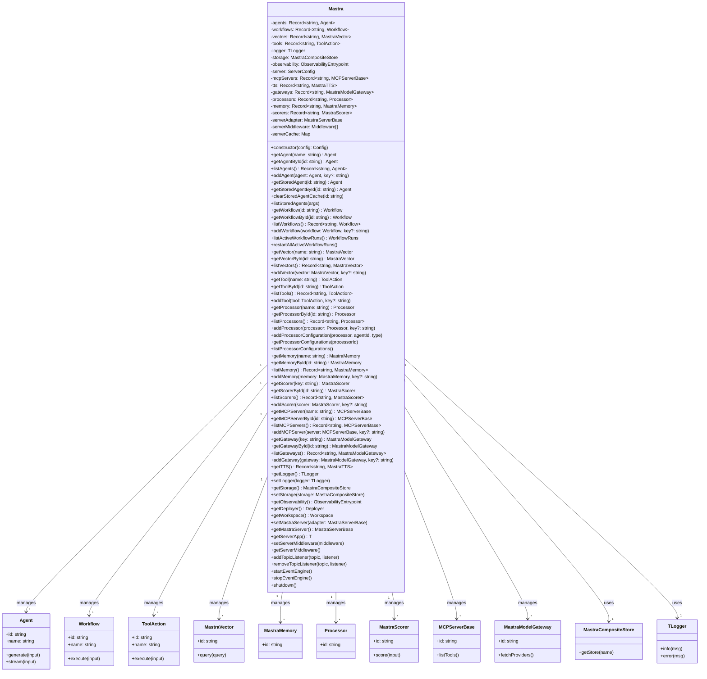

# Mastra Class Diagram

The following class diagram illustrates the structure of the `Mastra` class from `@mastra/core` and its relationships with other key components in the Mastra framework.

```mermaid
classDiagram
    class Mastra {
        -agents: Record~string, Agent~
        -workflows: Record~string, Workflow~
        -vectors: Record~string, MastraVector~
        -tools: Record~string, ToolAction~
        -logger: TLogger
        -storage: MastraCompositeStore
        -observability: ObservabilityEntrypoint
        -server: ServerConfig
        -mcpServers: Record~string, MCPServerBase~
        -tts: Record~string, MastraTTS~
        -gateways: Record~string, MastraModelGateway~
        -processors: Record~string, Processor~
        -memory: Record~string, MastraMemory~
        -scorers: Record~string, MastraScorer~
        -serverAdapter: MastraServerBase
        -serverMiddleware: Middleware[]
        -serverCache: Map
        
        +constructor(config: Config)
        +getAgent(name: string) Agent
        +getAgentById(id: string) Agent
        +listAgents() Record~string, Agent~
        +addAgent(agent: Agent, key?: string)
        +getStoredAgent(id: string) Agent
        +getStoredAgentById(id: string) Agent
        +clearStoredAgentCache(id: string)
        +listStoredAgents(args) 
        
        +getWorkflow(id: string) Workflow
        +getWorkflowById(id: string) Workflow
        +listWorkflows() Record~string, Workflow~
        +addWorkflow(workflow: Workflow, key?: string)
        +listActiveWorkflowRuns() WorkflowRuns
        +restartAllActiveWorkflowRuns()
        
        +getVector(name: string) MastraVector
        +getVectorById(id: string) MastraVector
        +listVectors() Record~string, MastraVector~
        +addVector(vector: MastraVector, key?: string)
        
        +getTool(name: string) ToolAction
        +getToolById(id: string) ToolAction
        +listTools() Record~string, ToolAction~
        +addTool(tool: ToolAction, key?: string)
        
        +getProcessor(name: string) Processor
        +getProcessorById(id: string) Processor
        +listProcessors() Record~string, Processor~
        +addProcessor(processor: Processor, key?: string)
        +addProcessorConfiguration(processor, agentId, type)
        +getProcessorConfigurations(processorId)
        +listProcessorConfigurations()
        
        +getMemory(name: string) MastraMemory
        +getMemoryById(id: string) MastraMemory
        +listMemory() Record~string, MastraMemory~
        +addMemory(memory: MastraMemory, key?: string)
        
        +getScorer(key: string) MastraScorer
        +getScorerById(id: string) MastraScorer
        +listScorers() Record~string, MastraScorer~
        +addScorer(scorer: MastraScorer, key?: string)
        
        +getMCPServer(name: string) MCPServerBase
        +getMCPServerById(id: string) MCPServerBase
        +listMCPServers() Record~string, MCPServerBase~
        +addMCPServer(server: MCPServerBase, key?: string)
        
        +getGateway(key: string) MastraModelGateway
        +getGatewayById(id: string) MastraModelGateway
        +listGateways() Record~string, MastraModelGateway~
        +addGateway(gateway: MastraModelGateway, key?: string)
        
        +getTTS() Record~string, MastraTTS~
        +getLogger() TLogger
        +setLogger(logger: TLogger)
        +getStorage() MastraCompositeStore
        +setStorage(storage: MastraCompositeStore)
        +getObservability() ObservabilityEntrypoint
        +getDeployer() Deployer
        +getWorkspace() Workspace
        
        +setMastraServer(adapter: MastraServerBase)
        +getMastraServer() MastraServerBase
        +getServerApp() T
        +setServerMiddleware(middleware)
        +getServerMiddleware()
        
        +addTopicListener(topic, listener)
        +removeTopicListener(topic, listener)
        +startEventEngine()
        +stopEventEngine()
        +shutdown()
    }

    class Agent {
        +id: string
        +name: string
        +generate(input)
        +stream(input)
    }

    class Workflow {
        +id: string
        +name: string
        +execute(input)
    }

    class ToolAction {
        +id: string
        +name: string
        +execute(input)
    }

    class MastraVector {
        +id: string
        +query(query)
    }

    class MastraMemory {
        +id: string
    }

    class Processor {
        +id: string
    }
    
    class MastraScorer {
        +id: string
        +score(input)
    }

    class MCPServerBase {
        +id: string
        +listTools()
    }

    class MastraModelGateway {
        +id: string
        +fetchProviders()
    }
    
    class MastraCompositeStore {
        +getStore(name)
    }
    
    class TLogger {
        +info(msg)
        +error(msg)
    }

    Mastra "1" --> "*" Agent : manages
    Mastra "1" --> "*" Workflow : manages
    Mastra "1" --> "*" ToolAction : manages
    Mastra "1" --> "*" MastraVector : manages
    Mastra "1" --> "*" MastraMemory : manages
    Mastra "1" --> "*" Processor : manages
    Mastra "1" --> "*" MastraScorer : manages
    Mastra "1" --> "*" MCPServerBase : manages
    Mastra "1" --> "*" MastraModelGateway : manages
    Mastra "1" --> "1" MastraCompositeStore : uses
    Mastra "1" --> "1" TLogger : uses
```
