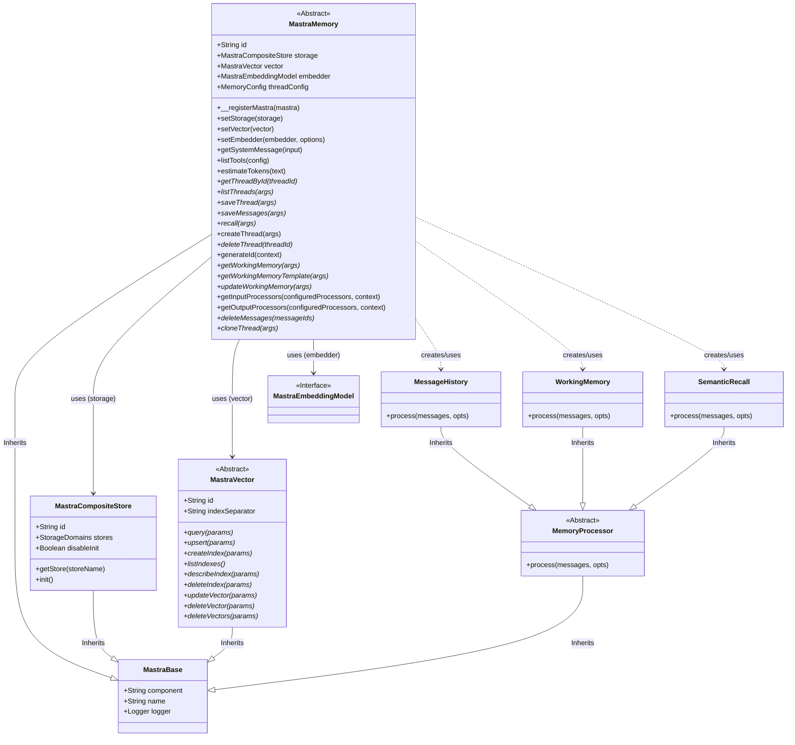

# MastraMemory Class Diagram

This diagram illustrates the structure of the `MastraMemory` class and its relationships with other core components like `MastraCompositeStore`, `MastraVector`, and memory processors.

## Relationships Breakdown

1.  **Inheritance**:
    *   `MastraMemory` extends `MastraBase`.
    *   `MastraCompositeStore` extends `MastraBase`.
    *   `MastraVector` extends `MastraBase`.
    *   `MemoryProcessor` extends `MastraBase`.
    *   `MessageHistory`, `WorkingMemory`, and `SemanticRecall` extend `MemoryProcessor`.

2.  **Associations**:
    *   **Storage**: `MastraMemory` relies on `MastraCompositeStore` (`storage` property) for persisting threads and messages.
    *   **Vector**: `MastraMemory` optionally uses `MastraVector` (`vector` property) for semantic search capabilities.
    *   **Embedder**: `MastraMemory` optionally uses `MastraEmbeddingModel` (`embedder` property) to generate embeddings for semantic recall.

3.  **Dependencies (Usage)**:
    *   `MastraMemory` instantiates and returns `MessageHistory`, `WorkingMemory`, and `SemanticRecall` processors in its `getInputProcessors` and `getOutputProcessors` methods, enabling these features in the agent workflow.
