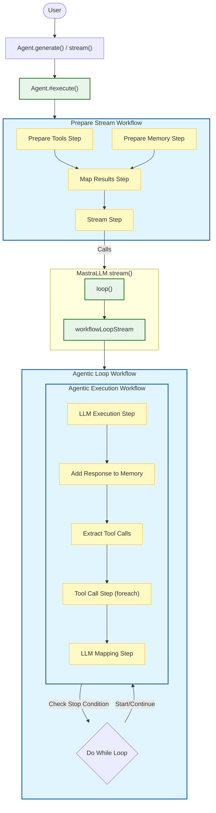

# Mastra Prompt Flow

This diagram illustrates how a prompt is processed through the Mastra framework, from the initial `Agent.generate()` or `Agent.stream()` call down to the low-level LLM and Tool execution loops.

## Key Components

1.  **Agent Entry Point**: The process starts with `Agent.generate()` or `Agent.stream()`, which delegates to `Agent.#execute()`.
2.  **Prepare Stream Workflow**: Configures the execution environment.
    *   **Prepare Tools**: Converts available tools (toolsets, memory, system) into `CoreTool` format.
    *   **Prepare Memory**: Retrieves thread history and context.
    *   **Stream Step**: The bridge to the LLM interaction.
3.  **LLM Stream**: The `MastraLLM.stream()` method (typically `MastraLLMVNext`) initiates the execution loop using `loop()`.
4.  **Agentic Loop Workflow**: Handles the iterative logic of "Think -> Act -> Observe". It runs the `AgenticExecutionWorkflow` in a loop until a stop condition (e.g., max steps, final answer) is met.
5.  **Agentic Execution Workflow**: A single iteration of the reasoning loop.
    *   **LLM Execution**: Calls the model API (OpenAI, Anthropic, etc.).
    *   **Add Response**: Saves the assistant's message to memory.
    *   **Tool Call Step**: Executes any requested tools (potentially in parallel).
    *   **LLM Mapping**: Formats tool results back into messages for the next LLM call.
