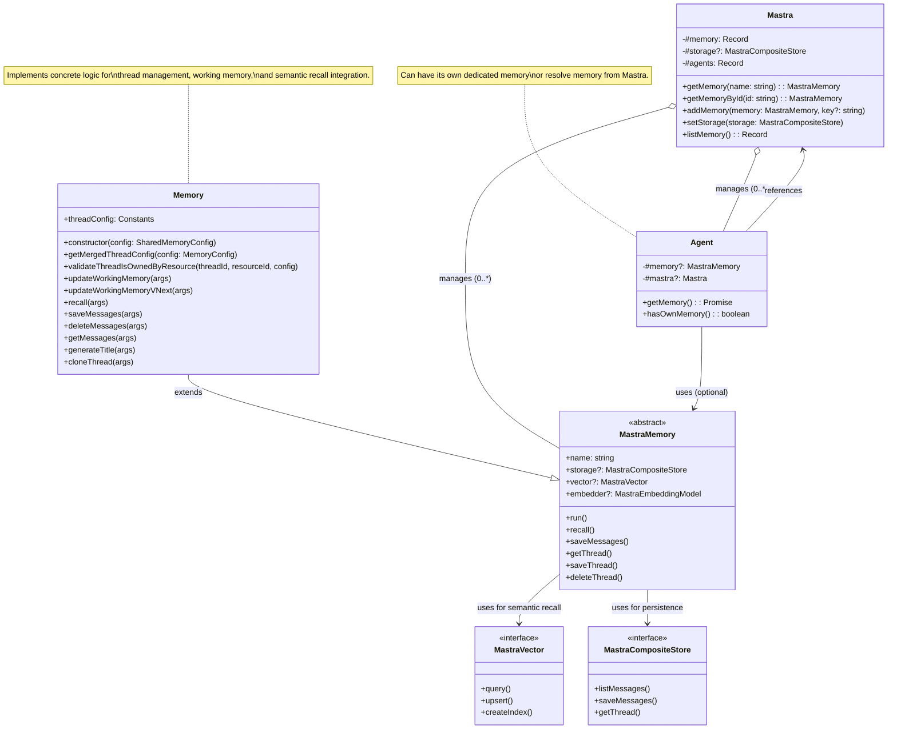

```mermaid
classDiagram
    class MastraMemory {
        <<abstract>>
        +name: string
        +storage?: MastraCompositeStore
        +vector?: MastraVector
        +embedder?: MastraEmbeddingModel
        +run()
        +recall()
        +saveMessages()
        +getThread()
        +saveThread()
        +deleteThread()
    }

    class Memory {
        +threadConfig: Constants
        +constructor(config: SharedMemoryConfig)
        +getMergedThreadConfig(config: MemoryConfig)
        +validateThreadIsOwnedByResource(threadId, resourceId, config)
        +updateWorkingMemory(args)
        +updateWorkingMemoryVNext(args)
        +recall(args)
        +saveMessages(args)
        +deleteMessages(args)
        +getMessages(args)
        +generateTitle(args)
        +cloneThread(args)
    }

    class Mastra {
        -#memory: Record<string, MastraMemory>
        -#storage?: MastraCompositeStore
        -#agents: Record<string, Agent>
        +getMemory(name: string): MastraMemory
        +getMemoryById(id: string): MastraMemory
        +addMemory(memory: MastraMemory, key?: string)
        +setStorage(storage: MastraCompositeStore)
        +listMemory(): Record<string, MastraMemory>
    }

    class Agent {
        -#memory?: MastraMemory
        -#mastra?: Mastra
        +getMemory(): Promise<MastraMemory | undefined>
        +hasOwnMemory(): boolean
    }

    class MastraVector {
        <<interface>>
        +query()
        +upsert()
        +createIndex()
    }

    class MastraCompositeStore {
        <<interface>>
        +listMessages()
        +saveMessages()
        +getThread()
    }

    Memory --|> MastraMemory : extends
    
    Mastra o-- MastraMemory : manages (0..*)
    Mastra o-- Agent : manages (0..*)
    
    Agent --> MastraMemory : uses (optional)
    Agent --> Mastra : references
    
    MastraMemory --> MastraVector : uses for semantic recall
    MastraMemory --> MastraCompositeStore : uses for persistence
    
    note for Memory "Implements concrete logic for\nthread management, working memory,\nand semantic recall integration."
    note for Agent "Can have its own dedicated memory\nor resolve memory from Mastra."
```
